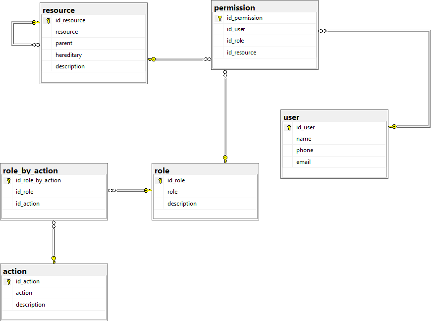
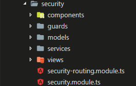
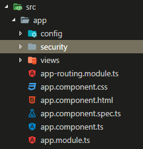
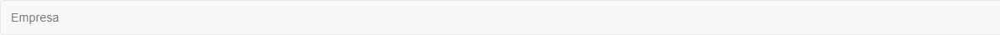
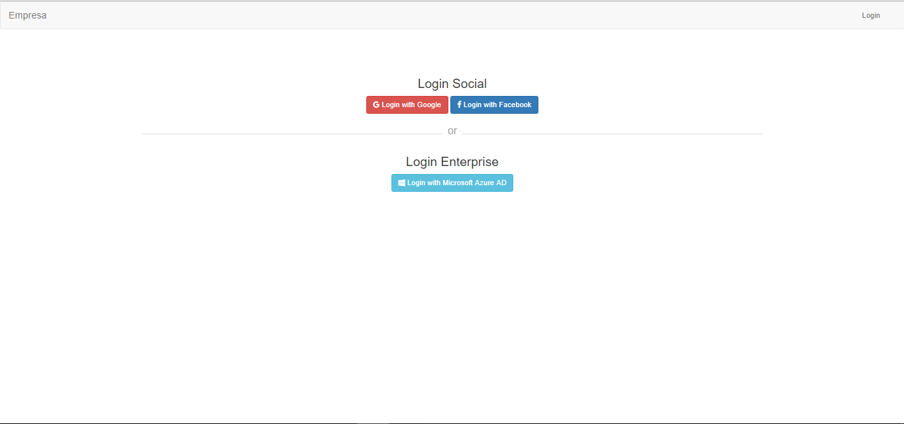
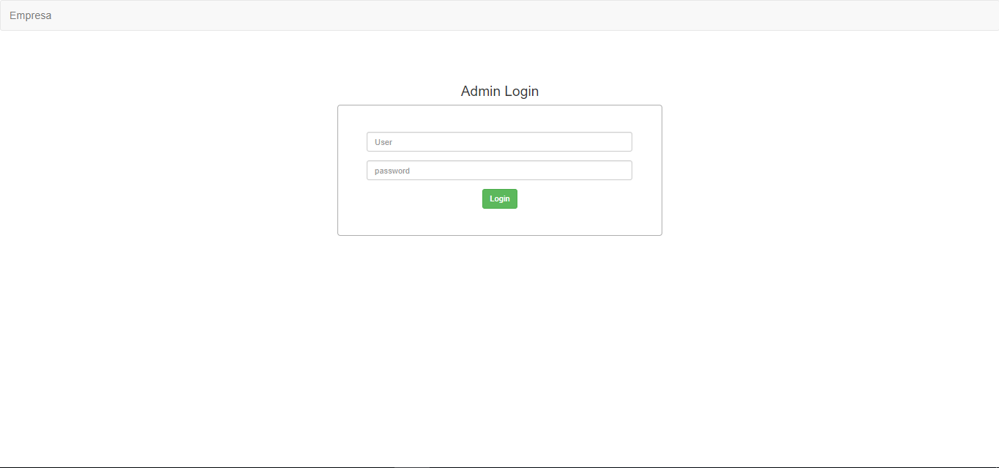

# **Documentación**

## **Descripción**

Este Módulo de seguridad servirá como base para futuros proyectos, en los cuales se requiera importar características como la de autentificar y registrar usuarios, creación de roles, recursos, acciones y además asignación de permisos.

Este módulo se divide en dos partes:

1. **Autentificación y registro de usuarios:** Está define toda la gestión de los usuarios en la aplicación con las sgtes tareas:
    
    * Iniciar sesión con Facebook, Google y Directorio Activo de Azure.
    * Registrar información complementaria en la aplicación.

2. **Autorización**: Está define toda la gestión del administrador en la aplicación, el administrador puede realizar las sgtes tareas:

    * Crear Recursos, Roles y Acciones.
    * Asignar permisos a un usuario.
    * Asignar acciones a un rol.
    * Listar Recursos, Roles, Acciones, Permisos y asignaciones de acciones a los roles.
    * Iniciar sesión como administrador.

## **Arquitectura**

La arquitectura usada en el módulo se compone de un backend realizado en `C#` con una `Web API tipo ODATA` la cuál suministra rutas para realizar el `CRUD` en las tablas, La `BD` se encuentra en el motor de `SQL SERVER` y la aplicación en el frontend está desarrollada en `Angular 4`.

### Modelo Entidad Relación 

### Rutas ODATA

Estas son las rutas generales que se utilizan en la api tipo ODATA, se debe tener en cuenta que el servidor por defecto es `localhost:3000`.

- http://localhost:3000/odata/actions
- http://localhost:3000/odata/roles
- http://localhost:3000/odata/permissions
- http://localhost:3000/odata/resources
- http://localhost:3000/odata/rolesByActions
- http://localhost:62073/odata/users

### Estructura básica del módulo

- **Services:** Conectan el backend y frontend, además realizan ciertas operaciones de la lógica de negocio.
- **Guards:** Manejan los permisos de acceso a ciertas rutas.
- **Models:** Esquemas utilizados en la BD, son utilizados también como mapping entre los esquemas de datos manejados backend y frontend.
- **Components:** Componentes reutilizables en todo el módulo, algunos de estos son las tablas y el navbar.
- **Views:** Las interfaces utilizadas tanto para la autentificación como para la autorización.

## **Configuración Inicial del módulo de seguridad**

Para utilizar el módulo en cualquier aplicación Angular se debe seguir los sgtes pasos:

1. Instalar los sgtes dependencias en el package.json de la aplicación

    - `npm install --save bootstrap@3`
    - `npm install --save jquery`
    - `npm install --save font-awesome`
    - `npm install --save roboto-fontface`
    - `npm install --save angular2-jwt`
    - `npm install --save auth0-js`
2. Descargar este repositorio o clonarlo, y luego copiar la carpeta security al directorio root de tu aplicación.

    

3. Importar la B.D llamada `security.bak` a tu instancia local de sql server o un servidor `azure`

4. Configurar un archivo en la raiz de tu proyecto el cuál recibe algunas propiedades que construyen el módulo security, el archivo lo llamaremos `config.ts`.

~~~
export const CONFIG:object = {
    // Por defecto es logo
    logo: "Empresa", 
    // Por defecto será localhost:3000
    apiSecurity:{
        host: 'localhost',
        port: 62073
    },
    // Todas las configuraciones para el sub-módulo de authentication
    authentication: {
        // Ruta inicial a la que redirige despues de registrarse
        routeInitial: 'home',
        // Configuración para el formulario de sign up
        signUpOpts:{
            fields:[
                {
                    name: 'Name'
                },
                {
                    name: 'Phone'
                },
                {
                    name: 'Email'
                }
            ]
        },
        // Configuración necesaria para el Auth0 y entrar con facebook
        configAuth0: {
            clientID: 'KwrIKkQyMkNsz0cRkCxZZU5isX8v7OJs',
            domain: 'yording.auth0.com',
            callbackURL: 'http://localhost:4200/callback'
        }
    },
    authorization: {
        // Credenciales de administrador
        user: 'Yording', // por defecto Admin
        password: '123', // por defecto Admin2017*
    }
}
~~~

Algunas de las principales propiedades de este archivo de configuración son:

* **logo:** El nombre usado en el navbar para identificar el proyecto

    

* **apiSecurity:** Configuración de la api que se utilizará para gestionar las tareas del módulo de seguridad, por defecto se utilizá como host `localhost` y puerto `3000`.

* **authentication:** Todas las configuraciones que se utilizarán para construir el sub-módulo de autentificación, entre estas podemos encontrar algunas propiedades como:

    1. **routeInitial:** Se define como la ruta inicial de la aplicación después de realizar el proceso de inicio de sesión y su posterior registro.

    2. **signUpOpts:** Configuraciones básicas para contruir el formulario de registro de usuarios, hasta el momento para el formulario solo se uso los fields que este iba a contener.

    3. **configAuth0:** Configuración necesaria para habilitar la gestión del inicio de sesión con terceros, para la implementación de dicha funcionalidad se utilizo el paquete provisto por `auth0-js`.

* **authorization:** Todas las configuraciones que se utilizarán para consruir el sub-módulo de autorización, entre estas podemos encontrar algunas propiedades como:

    1. **user:** Usuario de acceso al módulo de autorización, por defecto este cuenta con el valor de `Admin`
    2. **password:** Contraseña de acceso al módulo de autorización, por defecto este cuenta con el valor de `Admin2017*`

5. Importar el módulo de seguridad en nuestra módulo global, para ello se realiza un import en el archivo `app.module.ts` de la siguiente línea.

    ~~~
    import { SecurityModule } from './security/security.module';
    ~~~

6. Inyectar el archivo de configuración al módulo de seguridad, esto se realizá sobre el archivo `app.module.ts` sobre los imports del `ngModule`, primero importamos el archivo de configuración y luego se inyecta sobre el módulo.

    ~~~
    //config
    import { CONFIG } from './config/config'
    ~~~

    ~~~
    SecurityModule.forRoot(CONFIG)
    ~~~

    ~~~
    //app.module.ts
    import { BrowserModule } from '@angular/platform-browser';
    import { NgModule } from '@angular/core';
    import { SecurityModule } from './security/security.module';

    import { AppRoutingModule } from './app-routing.module';
    import { AppComponent } from './app.component';
    import { HomeComponent } from './views/home/home.component';

    //config
    import { CONFIG } from './config/config'

    @NgModule({
    declarations: [
        AppComponent,
        HomeComponent
    ],
    imports: [
        BrowserModule,
        AppRoutingModule,
        SecurityModule.forRoot(CONFIG)
    ],
    providers: [],
    bootstrap: [AppComponent]
    })
    export class AppModule { }
    ~~~

Además de lo anterior se debe crear un componente inicial sobre tu aplicación al cual se redirija cuando se inicie la sesión, para este caso se creo un nuevo componente llamado `HomeComponent` que contiene una etiqueta `

` con un mensaje de bienvenida.

Con estos pasos estaría listo el módulo de seguridad para ser probado dentro de la aplicación, para ellos se utilizan las siguientes etiquetas `<security-authentication></security-authentication>` está encapsula la lógica de negocio para el sub-módulo de seguridad y `<security-authorization></security-authorization>` que encapsula la lógica de negocio para la sub-módulo de autorización.

## **Iniciar la aplicación**

Los sgtes pasos es para iniciar la aplicación en tu navegador.

1. `npm start` este comando se ejecutá sobre la raiz de tu proyecto, posteriormente abrir una ventana de tu navegador y correrlo en el puerto que hayas configurado tu aplicación. Dependiendo el sub-módulo que estes utilizando te redijirá alguna de las sgtes interfaces

    * `<security-authentication></security-authentication>`
        
        
    * `<security-authorization></security-authorization>`

        

2. Iniciar el backend que se encuentra en este repositorio, para poder consumir las rutas de la `web api`, por defecto el puerto de este es `localhost:62073`.

